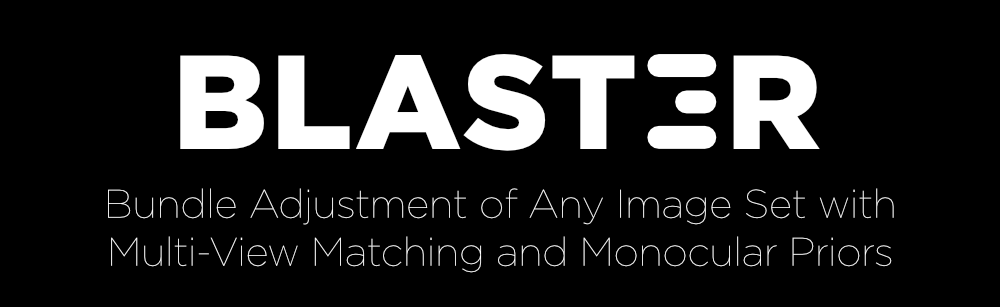

<p align="center">
    <br>
    <a href="https://arxiv.org/abs/2609.05210v1" target="_blank">📖 <b>Paper</b></a> • 
    <a href="https://www.youtube.com/watch?v=gll34XhZfGE" target="_blank">🎬 <b>Overview</b></a> • 
    <a href="#citation">🔖 <b>Cite</b></a>
</p>

BLASt3R is a 3D reconstruction system for unposed, uncalibrated images. Given a
collection of images or a video, it returns a camera pose, intrinsics and a dense
depthmap per frame, all recovered jointly by bundle adjustment. It runs offline
over an unordered image collection, the most accurate setting, and online over a
sequence, which amounts to incremental SLAM.

No calibration, poses or frame ordering are required.

## Install

Requires a GPU and a CUDA toolkit (`$CUDA_HOME` must be set). Start from a fresh
Python 3.11 or newer environment of your choice (e.g. conda, venv). Use Python
3.11 to 3.13 if you need `faiss-gpu`, for which no later wheels are published.
Everything below installs into the active environment.

```bash
# torch first, built against CUDA 12
pip install torch torchvision --index-url https://download.pytorch.org/whl/cu126

# the CUDA builds target visible GPUs architecture by default 
# set this to manually specify which arch to build for
# export TORCH_CUDA_ARCH_LIST="7.0;7.5;8.0;8.6;9.0"

pip install --no-build-isolation torch-scatter

# BLASt3R, including its two CUDA extensions
pip install --no-build-isolation -e .

# faiss, for image retrieval
pip install faiss-gpu
```

Install **either** `faiss-gpu` **or** `faiss-cpu`, never both, since they provide
the same module. `faiss-gpu` requires Linux x86_64 and CUDA 12; on any other
platform use `faiss-cpu`, which is functional but slower at retrieval. Without
faiss, reconstruction still runs, but falls back to a much weaker retrieval
heuristic.

## Quickstart

Run it on a folder of images, or on a video file:

```bash
python scripts/run_offline.py --images /path/to/images --output out --mono_cam
```

The two checkpoints download from the Hugging Face Hub on first use. No manual
download is required.

`--mono_cam` constrains every frame to share one set of intrinsics. Use it when
the input comes from a single camera, which is the usual case, and omit it
otherwise.

Multiple scenes in a single run, without reloading the models in between:

```bash
python scripts/run_offline.py --images /path/to/scenes/*/ --output out --mono_cam
```

Online reconstruction over a sequence, processing frames as they arrive:

```bash
python scripts/run_online.py --images /path/to/frames --output out \
  --mono_cam --frame_step 4
```

Results are written as one `.pth` file per scene. Inspect one with the viewer
below, or read it directly, as described in *Output format*.

## How it works

<!-- TODO(release): add the method figure here, e.g.
     <p align="center">" width="90%"></p> -->

BLASt3R has three components: a monocular network that predicts an adjustable
pointmap per image, a streaming matcher that produces multi-view tracks, and a
single bundle adjustment that solves for cameras and geometry at once. It never
partitions the input into chunks, so there are no local reconstructions to
stitch and no inconsistencies to resolve between them.

**Adjustable pointmaps.** The monocular network predicts a raymap and several
log-depth channels `F` per image, and the focal length follows from the raymap.
The depthmap used during optimization is an exponentiated linear combination of
those channels, `exp(alpha * F + beta)`, so a handful of coefficients per frame
can rescale and reshape the prediction. Monocular depth is a strong prior but an
ambiguous one: nothing in a single image fixes the relative depth of a
foreground object and a background that it does not touch. BLASt3R therefore
hands `alpha` and `beta` to the optimizer instead of freezing the prediction.

**Multi-view matching.** The matcher encodes each image once and keeps its
tokens in a memory bank, so a new frame attends to the frames already processed
rather than being paired with each of them in turn. Matching runs coarse to
fine. A first decoder scores patch pairs by cosine similarity between projected
tokens; a second decoder predicts pixel-level flow only inside the patch pairs
that score high enough. Both stages learn their own null threshold, so a pixel
with no correspondence is rejected rather than matched to the closest wrong
candidate. Aggregating the flows and selecting keypoints greedily yields tracks
that span many views. Image retrieval caps how many candidate frames each new
frame is matched against, which keeps the cost per frame constant and lets the
matcher scale to collections of any size.

**Unified bundle adjustment.** One optimization recovers focals, poses, 3D track
positions and the depth coefficients of every frame. Each observation
contributes the usual 2D reprojection error plus a third residual component, the
difference in log space between the adjustable depth at the observed pixel and
the depth of the projected track. Log space penalizes a track ten times too
close as much as one ten times too far, and multiplying by the focal expresses
the depth residual in pixel units, homogeneous with `x` and `y`. Its weight
`omega` controls the trade-off: at zero the objective is classical sparse bundle
adjustment, and raising it ties the depthmaps to the tracks and to one another.
BLASt3R optimizes at `omega = 1e-4` until convergence, then fixes poses and
focals and raises `omega` to stitch the pointmaps into one consistent surface.
The solver is a damped Levenberg-Marquardt scheme with a Huber loss, running on
GPU. Every iteration linearizes the residuals, eliminates the 3D points with the
Schur complement, and solves the reduced camera and depth system by sparse
Cholesky decomposition. Poses are initialized from a maximum spanning tree over
the match graph, each relative pose coming from Kabsch-Umeyama alignment of the
predicted pointmaps. No stage of the pipeline uses RANSAC.

**Offline and online.** Both modes run the same networks and the same bundle
adjustment. Offline, retrieval selects candidates from the whole collection and
a single bundle adjustment covers every frame. Online, frames are added as they
arrive: each new frame is matched against retrieved earlier frames and refined
by a short local bundle adjustment, and a global bundle adjustment every
`--gba_step` frames revises the earlier cameras and absorbs loop closures.

## Demo

`scripts/demo.py` runs the full pipeline from the browser: select images or a
video, reconstruct offline or online, and view the result as it is produced.
Online mode draws each frame as it is computed and moves the earlier cameras
whenever a global bundle adjustment revises them, so the reconstruction appears
as it is built rather than only in its final state.

```bash
python scripts/demo.py
```


The control panel serves on `127.0.0.1:8080` and embeds the 3D view from port
`8081` on whatever address the browser reached the panel on. **The browser must
be able to reach both ports**, so forward both when running on a remote
machine. The exact command is printed at startup. You can specify custom ports
for the main server and the visualization server via `--port` and `--viser_port`.
`--host 0.0.0.0` serves to the network instead, and `CUDA_VISIBLE_DEVICES`
selects the GPU.

One reconstruction runs at a time, and a new run replaces the scene in every
connected browser. **Download scene** becomes available once a run finishes and
hands the result to the browser as a `.pth` file, which
[`scripts/visualize.py`](#viewer) reopens. `--allow_local_files` adds a field
for an image directory on the server, granting read access to anyone who can
reach the demo.

## Viewer

`scripts/visualize.py` serves a saved reconstruction as an interactive 3D scene.
It requires `--export_mode full`, the default; a pose-only scene contains no
depthmaps and cannot be rendered.

```bash
python scripts/visualize.py --scenes out              # pick a scene from a directory
python scripts/visualize.py --scene  out/scene.pth
```

Then open the printed URL. The viewer serves on `127.0.0.1:8080` by default, so
forward the port when running on a remote machine, e.g.
`ssh -L 8080:localhost:8080 <host>`. `--host 0.0.0.0` serves to the network
instead, which also exposes the file picker to anyone who can reach the port.

The controls filter the scene live: a **confidence threshold** and **point
budget** determine which points are drawn, and a **frame range** restricts the
scene to a span of frames. **Clean point cloud** runs the same denoising as
`--denoise_depth`, in the background, leaving the original available under
*Source*.

## Options

The defaults are the values used for the published results, so reproducing them
requires no tuning.

| Flag | Effect |
|---|---|
| `--mono_cam` | All frames share one set of intrinsics. Use for single-camera input. |
| `--frame_step N` | Online only: reconstruct every Nth frame. |
| `--optim_memory` | Reduces GPU memory use on large scenes, at some cost in speed. |
| `--denoise_depth` | Cleans the depthmaps before saving. Off by default. |
| `--export_mode pose` | Saves poses and intrinsics only, a fraction of the size. |
| `--size N` | Long-edge image size for processing. Default 512. |

`--help` lists every flag, including the ones not in this table.

## Output format

One `.pth` per scene:

```python
import torch
scene = torch.load('out/scene.pth', weights_only=False)
for name, view in scene['views'].items():
    view['K']       # 3x3 intrinsics
    view['cam2w']   # 4x4 camera-to-world pose
    view['depth']   # depthmap, float32
    view['img']     # the resized input image, uint8
    view['conf']    # per-pixel confidence, float16
```

`--export_mode pose` keeps only `K` and `cam2w`.

## Benchmarks

Preparation and evaluation scripts are included for the following benchmarks reported in
the paper: ETH3D and CO3D v2 (offline), TUM-RGBD and ETH3D-SLAM (online).
[`docs/BENCHMARKS.md`](docs/BENCHMARKS.md) covers the preparation of each one and
the inference, evaluation and report scripts.


## Citation

```bibtex
@InProceedings{leroy2025blast3r,
  title={BLASt3R: Bundle Adjustment of Any Image Set with Multi-View Matching and Monocular Priors},
  author={Leroy, Vincent and Weinzaepfel, Philippe and Zust, Lojze and
Cabon, Yohann and Revaud, Jerome},
  booktitle={European Conference on Computer Vision (ECCV)},
  year={2026}
}
```

## License

BLASt3R is released under the NAVER non-commercial license (`LICENSE`), which
covers both the code and the released checkpoints. Third-party subcomponents,
the datasets the checkpoints were trained on and the pretrained weights they
were initialized from are acknowledged in `NOTICE`.

The monocular depth checkpoint was initialized from
[DINOv3](https://github.com/facebookresearch/dinov3) weights, so its use is
additionally subject to the
[DINOv3 License](docs/licenses/DINOv3_LICENSE.md).
